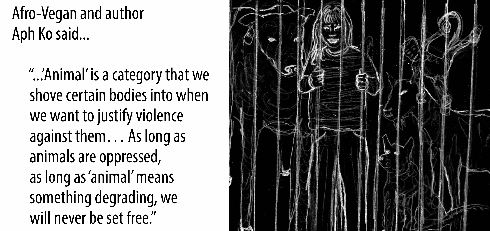

# The "animal" as a political category
## Notes from the reading and discussion prompts

## Related Resources 
- "Becoming Animal" - Book
- "Sacred Economy"
- "As we have always done" - Lean Simpson
- "Islands of de-colonial love" - Lean Simpson
- Quote from Braiding Sweetgrass: "Humans are the youngest beings, how can we learn from the elders?"
- Water World 

**Movies:**   
- North of North on Netflix
- Wicked
- Living world on Netflix

## Related marbles 

- The chicken nugget is the perfect embodiment of the [seven cheap things under capitalism](MMS7CheapThingsInTheChickenNugget.md).
- Stats on animal agriculture: [AGRICULTURE-A](AGRICULTURE-A.md).
- I created this visual for the reading group: [MMSMammalWeight-A](MMSMammalWeight-A.md)
- [MMSWorkLifeBeforeAgriculturalRevolution](MMSWorkLifeBeforeAgriculturalRevolution.md)

## Points of interest

**State, capitalism, and the animal:**   
- Dogs and cats are considered objects in Germany
- We need protection of animal enslavement facilities from the state
- Animals are the second oil for running our economy 

**Domestication of humans:**
- How do we force people into labor force?
	- We have done this before with dogs and sheep and horses
	- This is the origin of the Western education system: Taking away young humans from their roots/parents. %%Source from Kahayag%%
	- Any separation we create helps to disconnect for control. 

**In breakout groups, reflect on:**   
- How do we grow our food respectfully with all the relationships involved?
- How have you treated animals directly or indirectly through consumption throughout your life and did that treatment differ from what you consider humane treatment of humans?
- Reflect on the reasoning that its okay to treat animals differently from humans.
- Reflect on what hinders you to treat non-human animals with more care, and how you are empowered by others or able to overcome that threshold through attention setting. 

**Spiritual aspect of it:**   
•⁠  ⁠We are eating an animal that has been traumatized and unhappy their whole life
•⁠  ⁠⁠When we consume that trauma, that trauma will also live inside you
•⁠  ⁠⁠If we care about people in p being treated inhumanely, we may consider that 94 percent of mammals are being treated that way 

**Things i want to mention:**   
•⁠  ⁠Before the agricultural revolution, we worked as less or as much as we work nowadays. But nowadays, we use animals to work for us and have massive amounts of technology. Where has the progress gone? ([[MMSWorkLifeBeforeAgriculturalRevolution]])
•⁠  ⁠⁠If the state didn't prevent disclosure of animal enslavement, we would care differently about it.

## Quotes that stood out

### Exploiting the Nature/Society Divide
> "The field of World Ecology has sketched out important studies on how the 'nature vs. society' binary is used to justify the kind of ecological destruction required to maintain the growth imperative of capitalism."

### Constructing the Animal as Political Category
> "'Animal' as a political category within capitalism—an ideological tool used to extract surplus labor and justify exploitation, thus providing the material and ideological foundations for class-based societies."

### Dehumanizing Indigenous Peoples
> "The animalization of non-European peoples was an essential ideological tool used for the mass decimation and enslavement of Africans and indigenous peoples in the Americas."

### Establishing the First Exploitation Systems
> "Another transition preceded mass human enslavement—the domestication of non-human animals; the first enslaved beings and major surplus laborers."

### Controlling Reproductive Systems
> "Through the control, manipulation, and mechanization of non-human animals' reproductive systems, humans engineered free-living non-human animals into animals that were designed for production. At the same time, the ovaries of these non-human laborers became the engines which reproduced the interspecies slave system."

### Linking Animal Domination to Gender Inequality
> "It is no coincidence, then, that 'across a range of countries, a key factor associated with gender inequality is the introduction of a specific agricultural technology: the plough.'"

### Weaponizing Domesticated Animals
> "It was the use of oppressed horses as vehicles of transportation that gave the pastoralists the ability to make 'hit-and-run' raids, the capacity to travel great distances, and the power to lay siege to entire cities."

### Driving Colonial Expansion
> "A driving factor of European colonialism, particularly that of the Spanish and Portuguese, was a desire for more agrarian land upon which to graze livestock—one of the most lucrative sources of wealth at the time."

### Spreading Lethal Diseases
> "Smallpox, most likely transmitted to New Spain by Cortes's army, proceeded southward through Central America and infected the Inca state by the middle of the sixteenth century. Throughout the entire region, hundreds of thousands of indigenous people also perished from measles, mumps, influenza, and typhus, all diseases derived from domesecration."

### Imposing Environmental Injustice
> "In the U.S. context, polluting Concentrated Animal Feeding Operations are disproportionately located in communities of color, with human health impacts including increases in depression, anger, confusion, fatigue, and eye, nose, and throat irritation from air and water contamination."

### Connecting Forms of Exploitation
> "What unites the farmed pigs and the enslaved children is two-fold 1) they are both classified as beings whose denial of bodily autonomy is deemed legitimate through their political designation as 'animal' or 'less-than-human' and 2) they provide immeasurable value to the capitalist system as laborers whose bodies are used to produce value for someone with more societal power than they have."

### Preventing Liberation Through Categorization
> "'Animal,' is a category that we shove certain bodies into when we want to justify violence against them, which is why animal liberation should concern all who are minoritized [...]. As long as animals are oppressed, as long as 'animal' means something degrading, we will never be set free."

