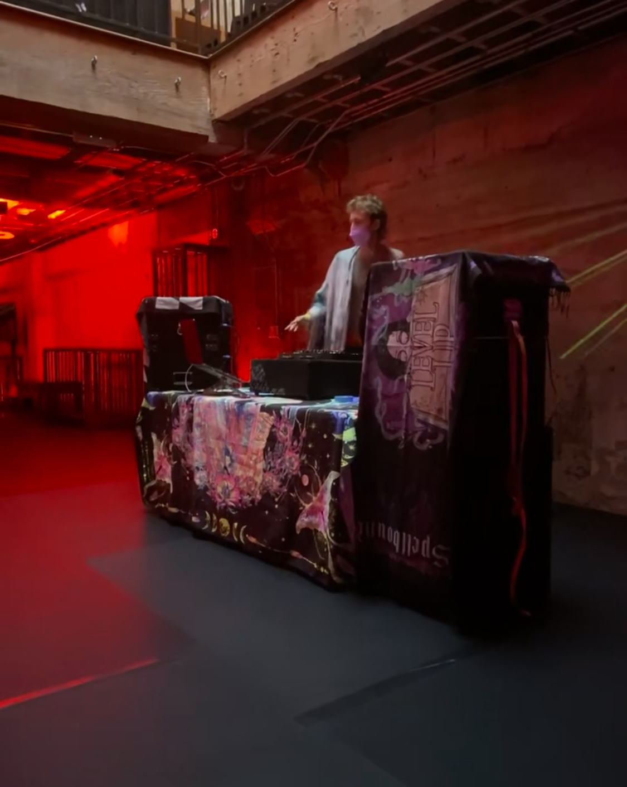
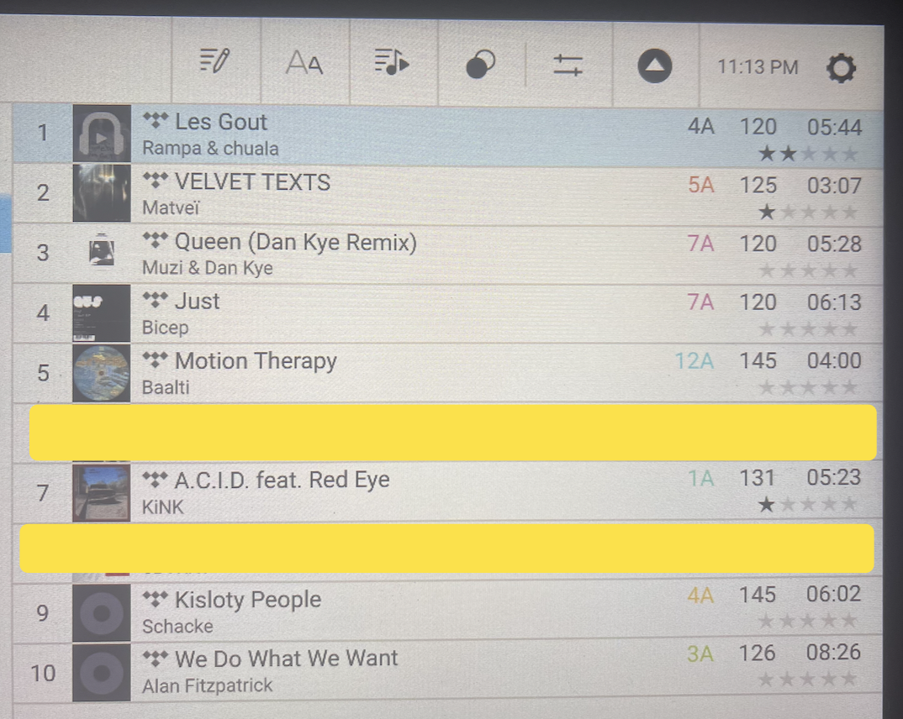
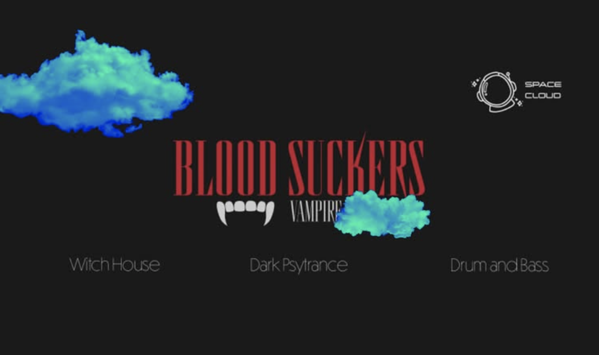

# Warm & Getting Faster Mix: Dance Tech to Techno + Beyond: Party zu Party

The general energy of this mix is warm and forward driving. It consistently keeps vocals in the space. Right now I don't have more to say about it besides that I am happy with it and that it captures my the uplifting sides of my spirit (and my partner's spirit).

<iframe width="100%" height="120" src="https://player-widget.mixcloud.com/widget/iframe/?hide_cover=1&light=1&feed=%2Fplus1electro_YT%2Fspace-cloud-from-dance-tech-to-techno-beyond-party-zu-party%2F" frameborder="0" ></iframe>

### These are the songs

### Spotify playlist with all these songs

<iframe style="border-radius:12px" src="https://open.spotify.com/embed/playlist/4abLqMPwuQUAe2W9OO0w0X?utm_source=generator" width="100%" height="352" frameBorder="0" allowfullscreen="" allow="autoplay; clipboard-write; encrypted-media; fullscreen; picture-in-picture" loading="lazy"></iframe>

### Spotify playlist with more inspirational songs for the set

<iframe style="border-radius:12px" src="https://open.spotify.com/embed/playlist/2asPft5NVNyIYUoUTWCBJE?utm_source=generator" width="100%" height="352" frameBorder="0" allowfullscreen="" allow="autoplay; clipboard-write; encrypted-media; fullscreen; picture-in-picture" loading="lazy"></iframe>

### [Chosic.com](https://www.chosic.com/spotify-playlist-analyzer/) thinks this about this playlist - just because its interesting and funny to see what an online brain has to say

#### Some more stats

## Flyer

