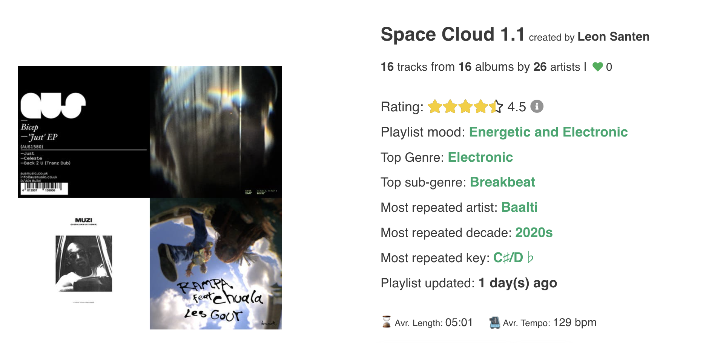
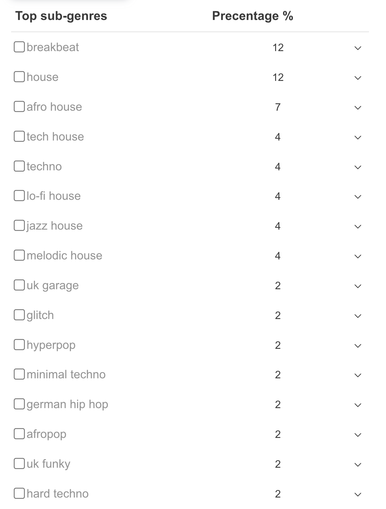

# Websites that visualize and analyze music
## A collection

### Everynoise - spacial map of genres
https://everynoise.com/engenremap.html

### Chosic - Genre, popularity, and diversity scanning
https://www.chosic.com/spotify-playlist-analyzer/
I used it for [this mix](EYT-SpaceCloud-April-11-2025.md). After I had recorded it!

### Ishkur's Guide to Electronic Music
https://music.ishkur.com/

### Liveplasma - similarity of artists
https://liveplasma.com/artist-Butch.html

