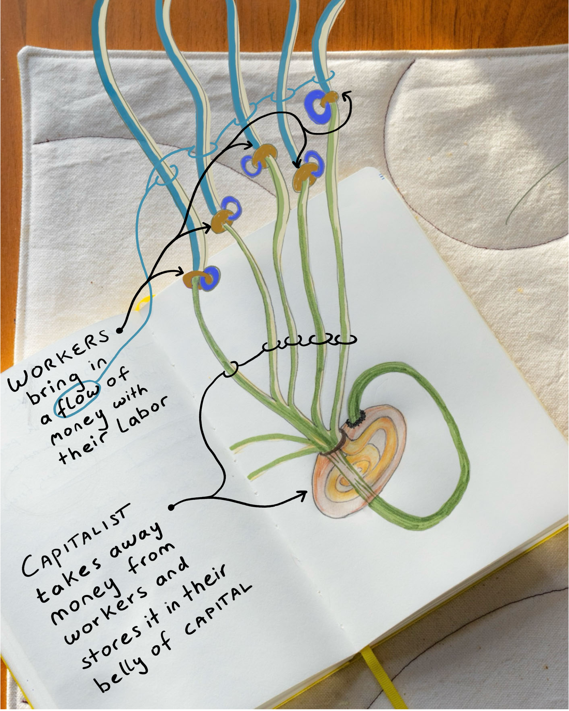
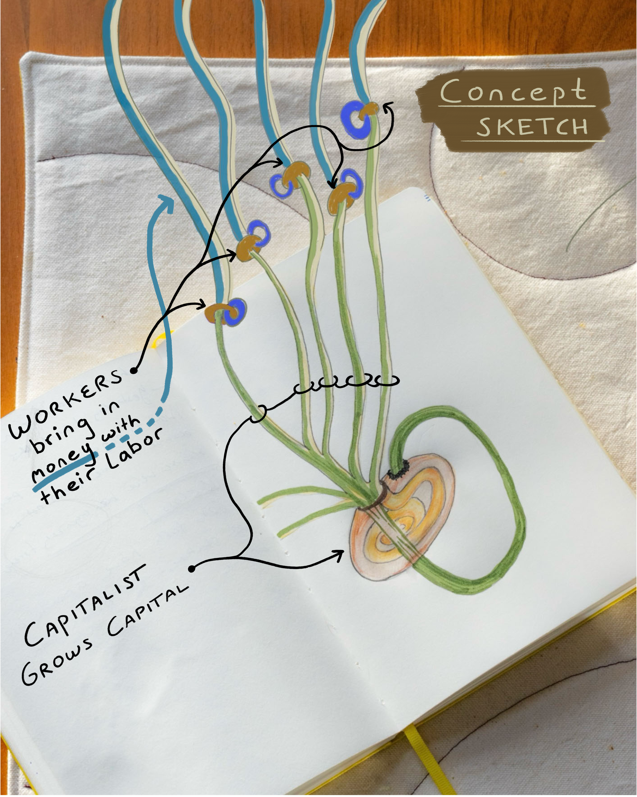

# Visualizing money stealing and hoarding in capitalist economies 
These drawings serve as visual concepts for my project to develop visual metaphors for systems understanding. The are concepts and have room for improvement 

#visualization #drawing