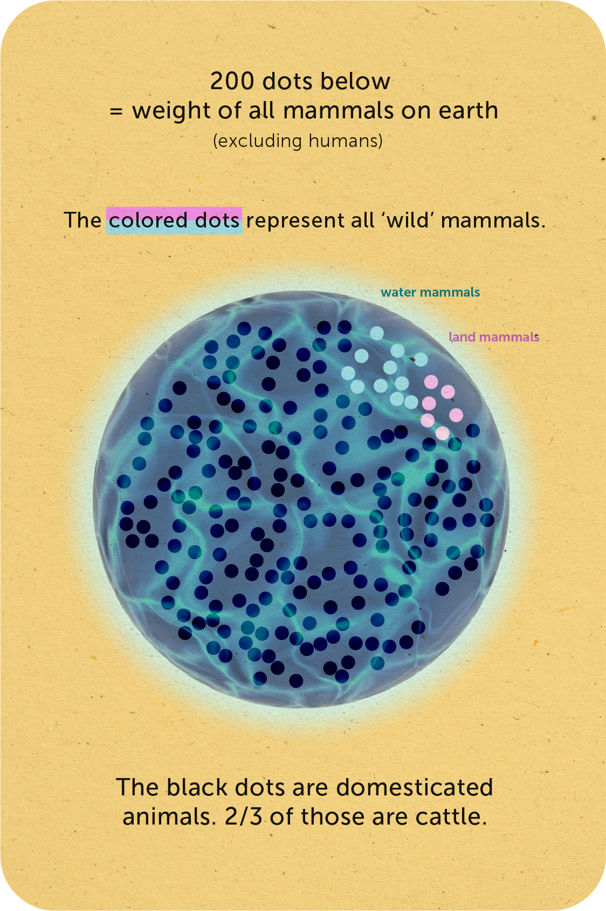
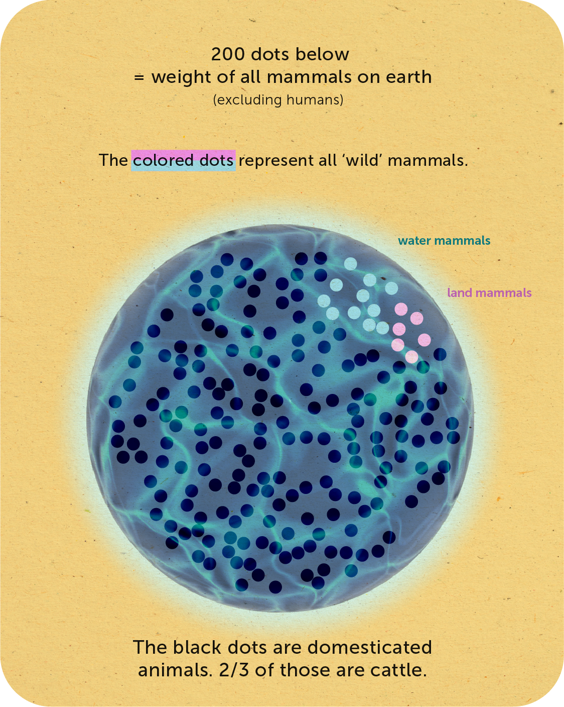
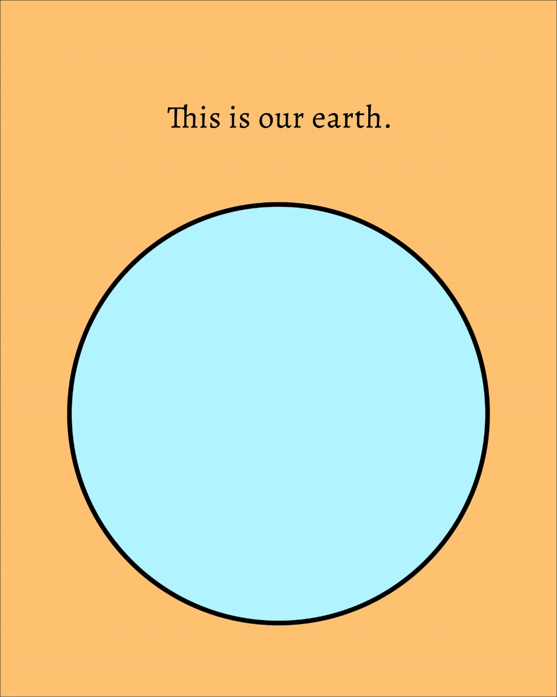
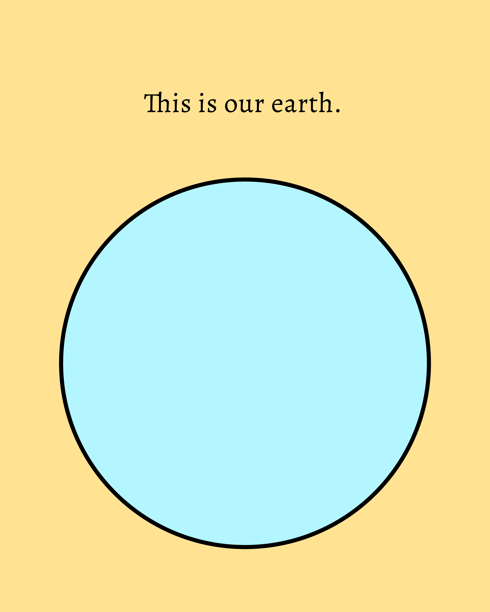
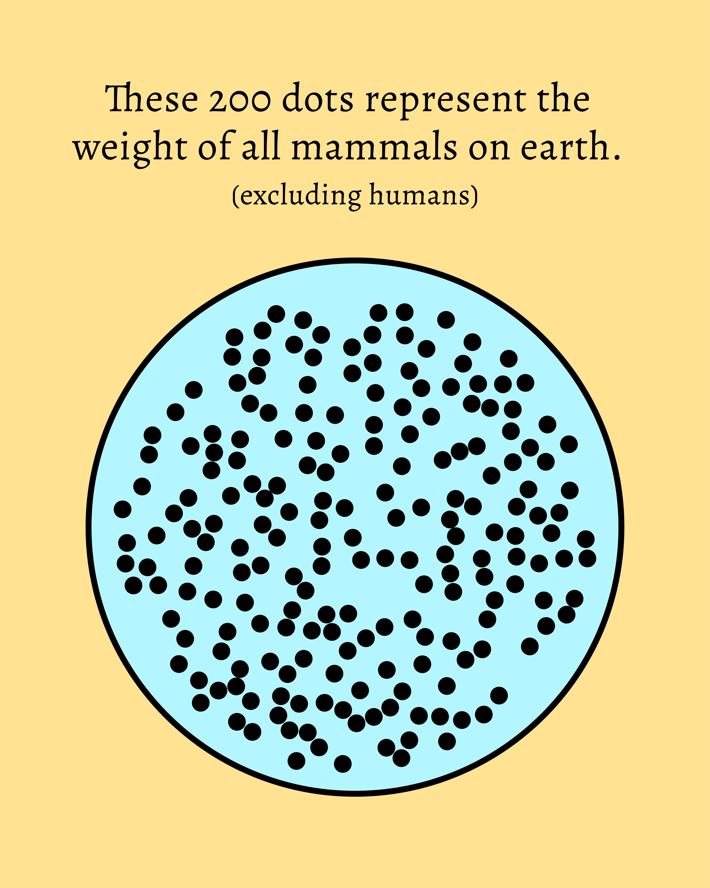
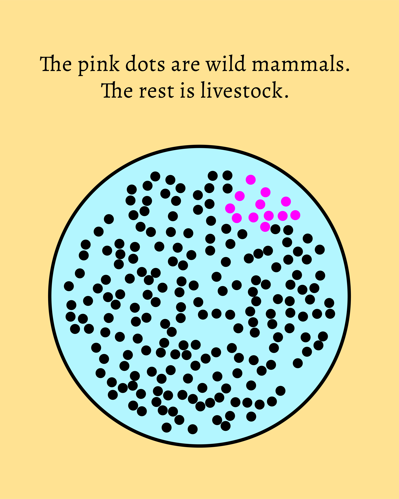
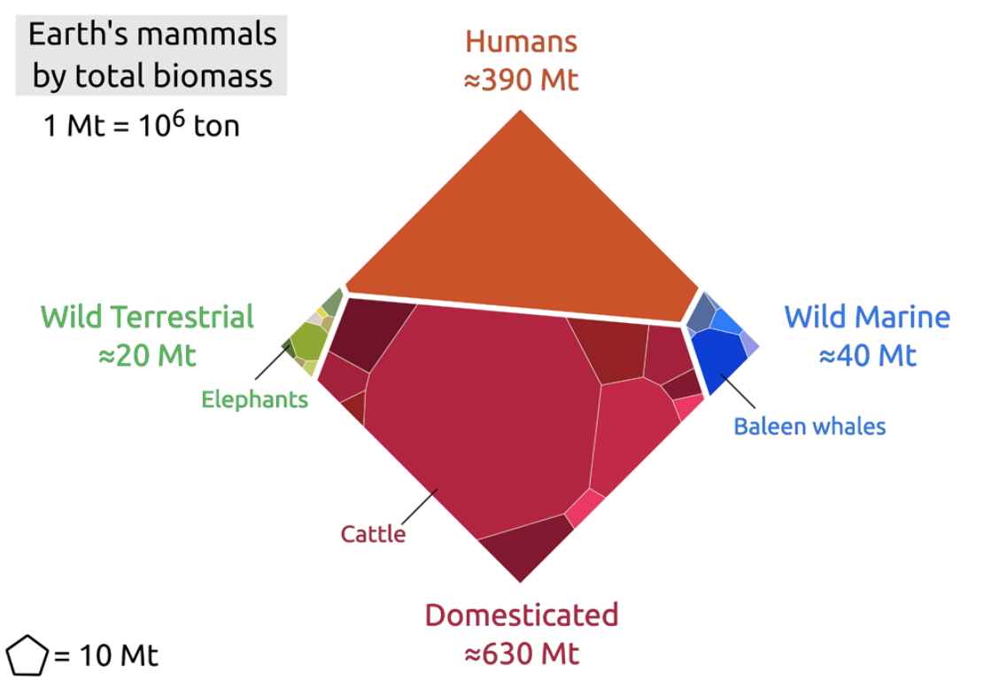
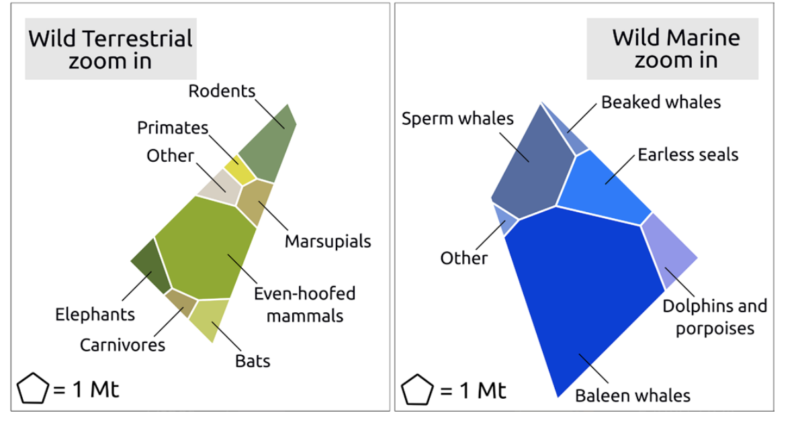
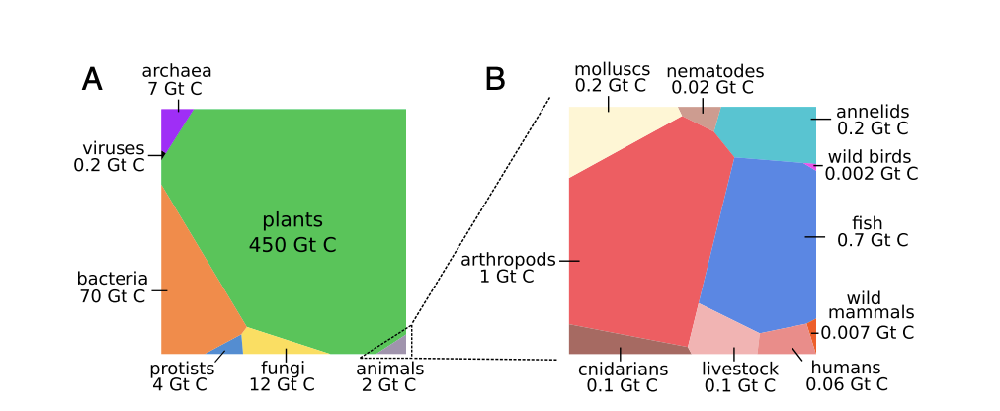
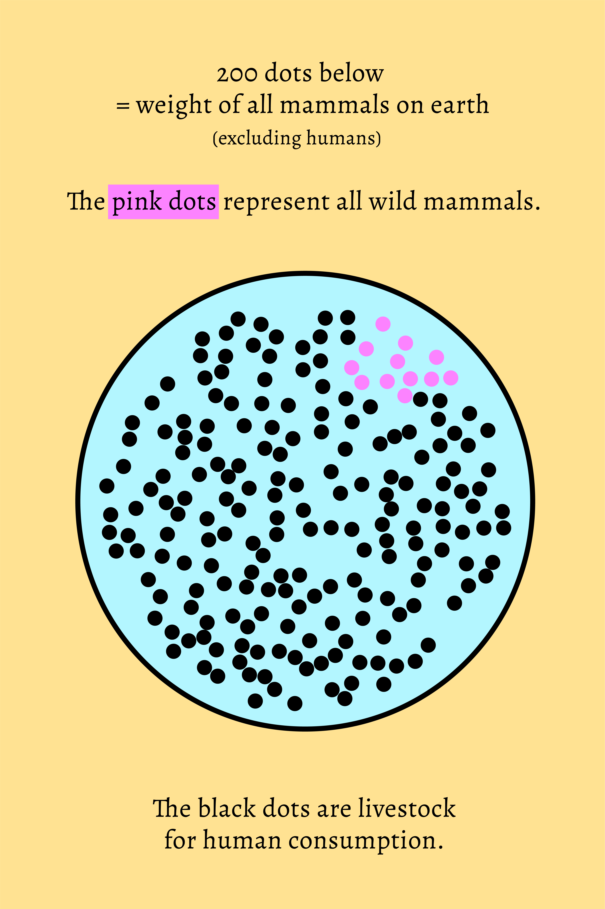

# Visualizing the ratio of wild mammals and enslaved mammals

This visual was inspired by an old collection of stats on [animal agriculture](AGRICULTURE-A.md).

# Sticker version

## Alone standing

## Gif

## Video animation link
https://share.icloud.com/photos/0415a85X4NR6KfnPUJL4PhxrA

## Series

## Reference

- Greenspoon et al. (2023) "[The global biomass of wild mammals](https://www.pnas.org/doi/pdf/10.1073/pnas.2204892120)" published in PNAS
- Bar-On et al. (2018) "[The biomass distribution on Earth](https://www.pnas.org/doi/pdf/10.1073/pnas.1711842115?trk=public_post_comment-text)" published in PNAS

Greenspoon (2023)

Greenspoon (2023)

Bar-On et al. (2018)

**I was originally inspired by the graphic below, but it seems to be outdated, showing higher "wild" mammal values that actually present.**

%%
## Old versions

%%

---

#agriculture #livestock #visualization #illustration 

---
