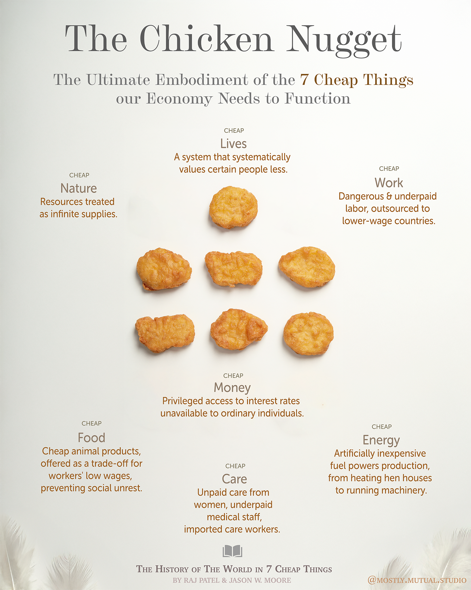

# How the chicken represents our economy perfectly
## An illustration and info graphic 

The [article and interview](https://truthout.org/articles/humans-arent-inherently-destroying-the-planet-capitalism-is/#libraryItemId=15170866) with the book author of "A history of the world in seven cheap things" inspired me to create an educational graphic that summarizes the seven cheap things that our economic system needs to function so extractively the way it does. 

>We thought that the idea of a chicken nugget was a helpful way of illustrating how the seven things come together, so in the book we make a pitch saying that the chicken nugget is the world’s most capitalist object. The reason we think that is because one of the signs of the Anthropocene is chicken bones — 50 billion chickens are eaten every year. That’s a lot of chicken bones, and the numbers are going up. One of the ways that any future intelligence will know that humans were on the planet will be through these chicken bones.
>
>So we decided to deconstruct the chicken nugget. First of all, in order to have your chicken nugget, you need chicken. Specifically, you need a chicken that’s been modified to the extent that it looks very unlike the red jungle fowl that was the first original chicken, because the modern broiler chicken has breasts so large it can barely walk — it’s really quite unrecognizable from its original ancestor. What that demonstrates is that **humans feel so separate from the rest of the web of life that we feel able and licensed to take animals and mutate them** in ways that are very much geared toward profit. That’s what cheap nature means. **It’s both the idea that we think of the rest of the web of life as an infinite resource and an infinite trashcan**, but also that we ourselves do not recognize ourselves as natural — we see ourselves as very distinct from nature.
>
>~ Raj Patel during an [interview with Truthout](https://truthout.org/articles/humans-arent-inherently-destroying-the-planet-capitalism-is/#libraryItemId=15170866)

### Related Marbles

- A graphic and animation I made: [Visualizing the ratio of wild mammals and enslaved mammals](MMSMammalWeight-A.md)
- An illustration I made: [Visualizing money stealing and hoarding in capitalist economies ](MMSCapitalistMoneyFlowViz.md)
- A statistics collection: [Summary of Emissions of Agriculture and Livestock](AGRICULTURE-A.md)
- A research project of mine: [You don't live in a democracy when every big institution around you is run like a dictatorship](MMSEconomicDemocracy.md)

- A video that opened my eyes: [How our work culture has shifted compared to medieval times ](WORK-CULTURE-MEDIEVAL-STONAGE-NOW.md)
- An important realization: [Dictatorship in the workplace](DICTATORSHIP-A.md)
- An introduction: [Difference and division are core-components of capitalist thriving ](MMSCapitalismA.md)

#illustration #info-graphic #mostly-mutual-studio

### Reference

[1] Patel, R., & Moore, J. W. (2017). A history of the world in seven cheap things: A guide to capitalism, nature, and the future of the planet. University of California Press.

[2] Interview about the Book on Truthout: https://truthout.org/articles/humans-arent-inherently-destroying-the-planet-capitalism-is/#libraryItemId=15170866