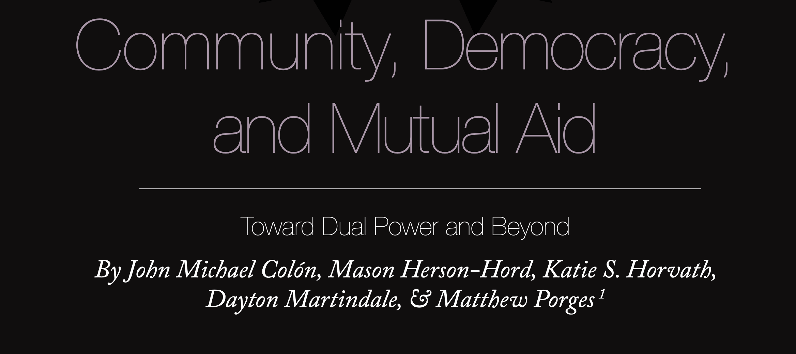

"The German-American political philosopher Hannah Arendt argued that intolerable situations such as ours could be cast aside by the public’s revolutionary  withdrawal of support from governing institutions. As a prominent theorist  of totalitarianism, political violence, and direct democracy, Arendt developed  important concepts that help disentangle the problems humanity currently faces  and indicate a way forward.

Power is conventionally understood in politics as the ability to make others do  things, often through violence or coercion to enforce obedience and domination.  In On Violence, however, Arendt demonstrates that power works quite differently in actual human societies. She defines “power” as people’s ability to act in  concert—the capacity for collective action, and thus a property of groups, not  individuals. Leaders possess their power only because their constituents have  empowered them to direct the group’s collective action.  

Arendt argues that all power, in every political system from dictatorships to participatory democracies, emerges from public support. No dictator can carry out  his or her will without obedience from subjects; nor can any project requiring  collective action be achieved without the support, begrudging or enthusiastic, of  the group. When people begin to withdraw their support and refuse to obey, a  government may turn to violence, but its control lasts only as long as the army or  police choose to obey. “Where commands are no longer obeyed,” Arendt writes,  “the means of violence are of no use... Everything depends on the power behind  the violence.”4 The understanding that power emerges from collective action,  rather than from force, is a key component of our transitional vision.

As a revolutionary political strategy, however (rather than a mere description of  certain past political events), Arendt’s theory of power requires several modifications. First, without preexisting mass organization, the public has no way to  collectively withdraw its support.  

Individuals acting alone have no impact on the state’s power. This is why Arendtian revolutions (Hungary in 1956, Czechoslovakia in 1989, and Tunisia in 2011)  occur only in exceedingly rare moments of crisis.

Second, most people will never even consider retracting support for governing  institutions if they don’t see viable alternatives. As Antonio Gramsci explained  a century ago, the ruling class’s cultural hegemony can be undermined only by  what he called a “war of position”— developing a material and cultural base  within the working class to craft an oppositional narrative and to organize oppositional institutions.5 The organization of unions, worker-owned firms, and housing cooperatives is what makes socialism a real, lived possibility around which  greater movement-building can occur.  

Third, withdrawal has serious costs. Even absent violent repression (a feature  of even today’s most liberal democracies), we are made dependent on capitalist  and state institutions for access to basic survival needs and avenues for collective  action. Transcending capitalism and the state thus requires having alternative  institutions in place to meet those needs and organize people to act powerfully in  concert with one another. Retracting support without engaging in such oppositional institutions is hardly distinguishable from apathy.

Fourth, we cannot neglect the preformation of the post-revolutionary societythe need to actively create institutions to replace the ones we have now. Arendt  has somewhat romantic notions of the forms of organic democratic politics  that emerge in the vacuum following a mass public retraction of support for  governing institutions. To a certain extent, history is on her side. The Syrian  Kurds’ democratic confederalism in Rojava; the workers’ councils of revolutionary Russia, Germany, and Hungary; the Paris Commune; Argentina’s factory  takeovers; and Catalonia’s anarchist revolution all exemplify community-rooted participatory politics emerging out of revolutionary crisis. More complex institutional arrangements to manage and coordinate society as a whole, however,  are beyond the reach of spontaneous face-to-face democracy. Far from expressing public will, such institutions are usually seized or assembled by whichever  party or faction is best positioned to capitalize on the conditions of vacuum and  uncertainty (as Arendt herself notes and criticizes).6 A revolutionary transfer  of authority to popular organs of radical democracy requires the preexistence of  such participatory institutions, not a naive faith that they will be conjured into  being out of a general strike, mass retraction of public support, or insurrectionary upheaval. "